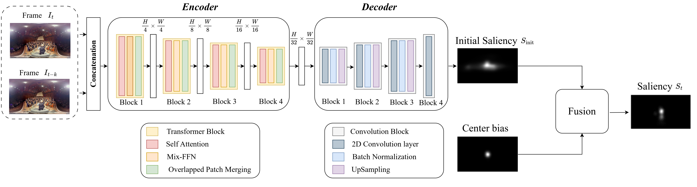

# SalFormer360: A Transformer-Based Saliency Estimation Model for 360-Degree Videos

This repository contains the source code for the **SalFormer360** model published in _IEEE Transactions on Broadcasting_.

**Mahmoud Z. A. Wahba, Francesco Barbato, Sara Baldoni and Federica Battisti**, "SalFormer360: A Transformer-Based Saliency Estimation Model for 360-Degree Videos," in _IEEE Transactions on Broadcasting_, vol. 72, no. 2, pp. 533-544, June 2026, doi: [10.1109/TBC.2026.3668621](https://doi.org/10.1109/TBC.2026.3668621).

## Abstract

Saliency estimation has received growing attention in recent years due to its importance in a wide range of applications. In the context of 360-degree video, it has been particularly valuable for tasks such as viewport prediction and immersive content optimization. In this paper, we propose **SalFormer360**, a novel saliency estimation model for 360-degree videos built on a transformer-based architecture. Our approach is based on the combination of an existing encoder architecture, SegFormer, and a custom decoder. The SegFormer model was originally developed for 2D segmentation tasks, and it has been fine-tuned to adapt it to 360-degree content. To further enhance prediction accuracy in our model, we incorporated a viewing center bias to reflect user attention in 360-degree environments. Extensive experiments on the three largest benchmark datasets for saliency estimation demonstrate that SalFormer360 outperforms existing state-of-the-art methods. In terms of Pearson correlation coefficient, our model achieves 8.4% higher performance on Sport360, 2.5% on PVS-HM, and 18.6% on VR-EyeTracking compared to previous state-of-the-art.

## Model Architecture

The overall architecture of SalFormer360 is illustrated below.



> **Figure:** Overview of the SalFormer360 architecture.

## Citation

If you use SalFormer360 or this repository in your research, please cite our paper using the following BibTeX entry:

```bibtex
@ARTICLE{11424030,
  author={Wahba, Mahmoud Z. A. and Barbato, Francesco and Baldoni, Sara and Battisti, Federica},
  journal={IEEE Transactions on Broadcasting},
  title={SalFormer360: A Transformer-Based Saliency Estimation Model for 360-Degree Videos},
  year={2026},
  volume={72},
  number={2},
  pages={533-544},
  keywords={Videos;Feature extraction;Optical flow;Solid modeling;Decoding;Computational modeling;Three-dimensional displays;Saliency detection;Transformers;Saliency estimation;omni-directional video;viewing bias;transformers},
  doi={10.1109/TBC.2026.3668621}
}
```

## Project Structure

```text
saliency_360_project/
├── dataset.py
├── data_transformation.py
├── model.py
├── losses.py
├── metrics.py
├── train.py
├── test.py
├── generate_images.py
├── model_weights/
│   ├── 360/
│   │   └── model_params_6_14600.pth
│   ├── pvs/
│   │   └── model_params_1_1100.pth
│   └── eye/
│       └── model_params_1_6300.pth
├── bias/
│   ├── 360_bias.png
│   ├── pvs_bias.png
│   └── eye_bias.png
│
├── datasets/
│   ├── 360
│   ├── pvs
│   └── eye
│
├── results/
├── requirements.txt
├── README.md
└── .gitignore
```

### Main Components

- **`dataset.py`** — Unified data loader for the supported datasets.
- **`data_transformation.py`** — Data preprocessing and transformations.
- **`model.py`** — SalFormer360 model.
- **`losses.py`** — Training loss functions.
- **`metrics.py`** — Saliency evaluation metrics.
- **`train.py`** — Model training and checkpoint generation.
- **`test.py`** — Model evaluation.
- **`generate_images.py`** — Qualitative result generation.

## Requirements

The project requires Python and the following libraries:

```text
torch
torchvision
transformers
numpy
scipy
Pillow
tqdm
tensorboard
```

Install the required Python packages:

```bash
pip install -r requirements.txt
```

## Installation

Clone the repository:

```bash
git clone https://github.com/LTTM/SalFormer360.git
cd saliency_360_project
```

For GPU training, make sure that the installed PyTorch version is compatible with your CUDA environment.

## Preparation

### 1. Download the Datasets

This project uses three 360° video saliency datasets.  
Please download and place them inside the `datasets/` directory following the structure below:

```text
datasets/
├── 360/
│
├── pvs/
│
└── eye/

```

#### **1. Sport360 Dataset**

Download the original Sport360 dataset from its official repository:

**https://github.com/xuyanyu-shh/Saliency-detection-in-360-video**

Place Sport360 data inside datasets/360/:

#### **2. PVS-HM Dataset**

Download the processed PVS-HM dataset from [link] and place it in inside datasets/pvs/:
This dataset has been processed following the procedure described in our paper (_Experimental Results → Datasets_ section).

#### **3. VR-EyeTracking Dataset**

Download the processed VR-EyeTracking dataset from [link] and place it in inside datasets/pvs/:
This dataset also has been processed following the procedure described in our paper (_Experimental Results → Datasets_ section).

#### **4. Optional**

Download the original PVS-HM dataset from:

**https://github.com/YuhangSong/DHP**

Download the original VR-EyeTracking dataset from:

**https://github.com/xuyanyu-shh/VR-EyeTracking**

### 2. Model Weights

The repository provides the trained model weights organized by dataset:

```text
model_weights/
├── 360/
│   └── model_params_6_14600.pth
├── pvs/
│   └── model_params_1_1100.pth
└── eye/
    └── model_params_1_6300.pth
```

The checkpoint is automatically selected according to the dataset specified through the command line.

### 3. Initial Frame Center Bias

The dataset-specific Initial Frame Center Bias images are stored in:

```text
bias/
├── 360_bias.png
├── pvs_bias.png
└── eye_bias.png
```

## Training

The number of training iterations is automatically selected according to the dataset:

| Dataset | Iterations |
| ------- | ---------: |
| 360     |     14,600 |
| Eye     |      6,300 |
| PVS     |      1,100 |

Only the final model checkpoint is saved.

To train on the Sport360 Saliency Dataset:

```bash
python train.py --dataset 360
```

To train on VR-EyeTracking:

```bash
python train.py --dataset eye
```

To train on PVS-HM:

```bash
python train.py --dataset pvs
```

## Qualitative Results

Generate visual results with:

```bash
python generate_images.py --dataset eye
```

The script generates ground-truth saliency, predicted saliency, and original-frame images.

## Evaluation

The model is evaluated using commonly used saliency estimation metrics, including:

- Pearson Correlation Coefficient (CC)
- Normalized Scanpath Saliency (NSS)
- Kullback-Leibler Divergence (KL)
- Area Under the ROC Curve (AUC-Judd)
- Similarity (SIM)

The evaluation procedure also accounts for the spherical nature of 360-degree content through latitude-based weighting.

## Loss Functions

The training objective combines multiple saliency estimation losses:

```text
Total Loss = KL Loss + CC Loss + Spherical MSE Loss + BCE Loss
```

The implementation of these losses is provided in `losses.py`.

## Reproducibility

To reproduce the experiments, download and prepare the required datasets, install the dependencies listed in `requirements.txt`, and select the corresponding dataset using the `--dataset` argument.

For example:

```bash
python test.py --dataset 360
```

or:

```bash
python test.py --dataset pvs
```

or:

```bash
python test.py --dataset eye
```

Dataset files are not included in this repository. Configure their paths before running the code.
