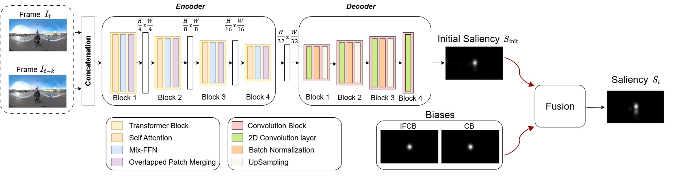

# SalFormer360

Official repository of the paper SalFormer360: Transformer-Based Saliency
Estimation for 360-Degree Video Frames

---

## Abstract

Saliency estimation has received growing attention in recent years, due to its importance in a wide range of applications. In the context of 360-degree video, it has been particularly valuable for tasks such as viewport prediction and immersive content optimization. In this paper, we propose SalFormer360, a novel saliency estimation model for 360-degree videos built on a transformer-based architecture. Our approach is based on the combination of an existing encoder architecture, SegFormer, and a custom decoder. The SegFormer model was originally developed for 2D segmentation tasks and it has been fine-tuned for adapting it to 360-degree contents. To further enhance prediction accuracy
in our model, we incorporated viewing biases such as Initial Frame Center Bias (IFCB) and Center Bias (CB) to reflect the natural user attention in 360-degree environments. Extensive experiments on the three largest benchmark datasets for saliency estimation demonstrate that SalFormer360 outperforms existing state-of-the-art methods. In terms of Pearson Correlation Coefficient (CC), our model achieves 8.34% higher performance on Sport360, 2.60% on PVS-HM, and 18.60% on VR-Eyetracking compared to previous state-of-the-art.

  

> [!NOTE]  
> The official code implementation will be available upon paper acceptance
